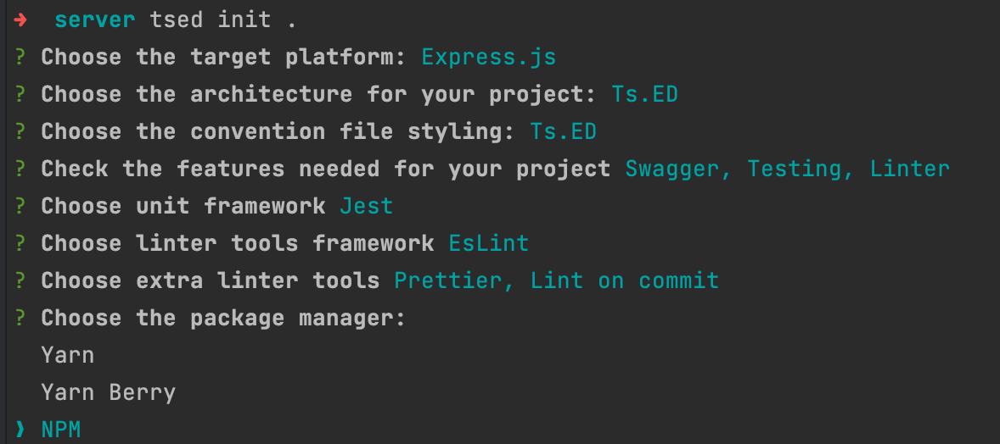
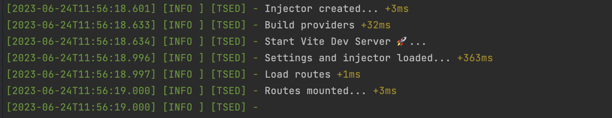
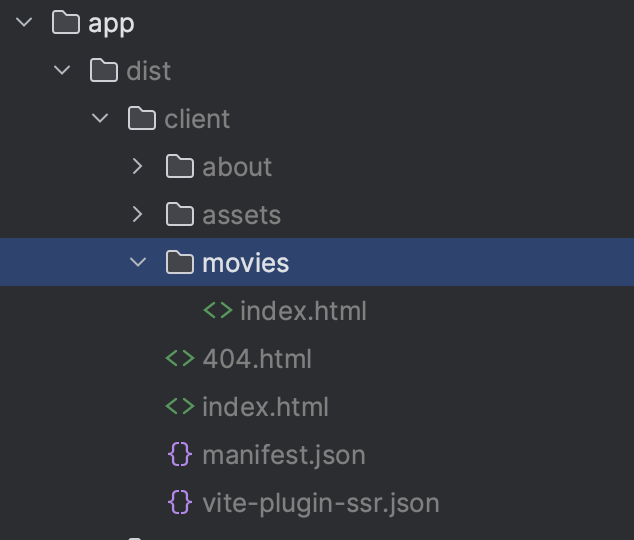
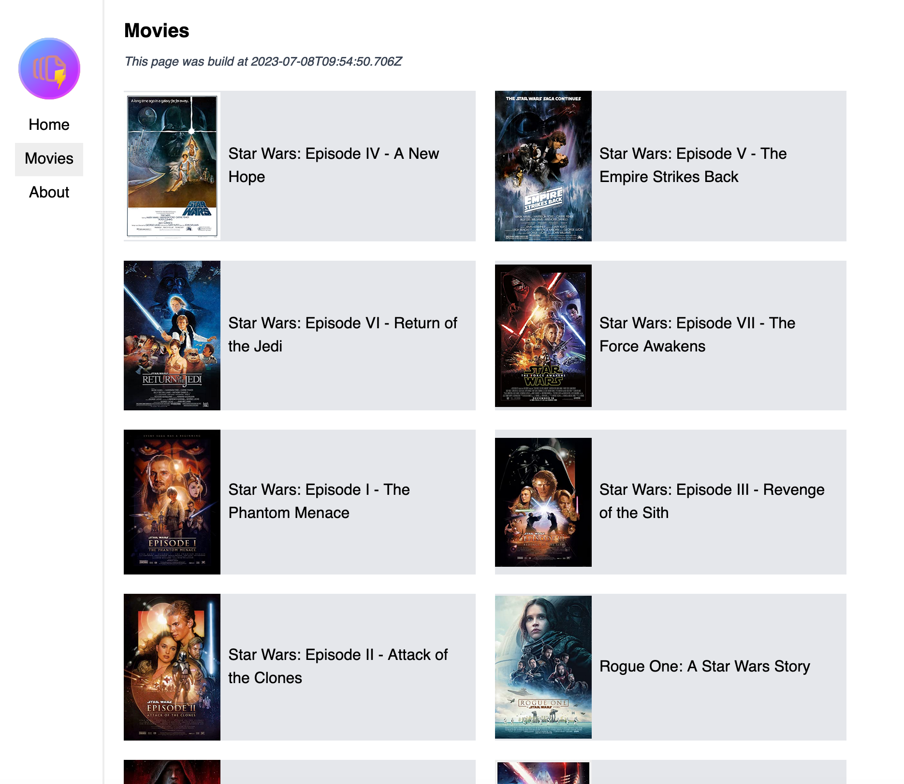
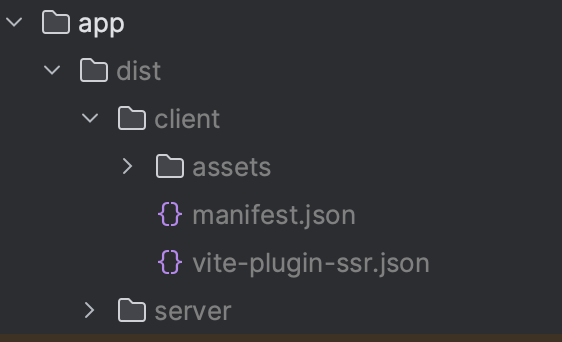

As you know, Vite is an incredible front-end tool that has revolutionized the developer experience, just like  Webpack did in its time.

Vite is a build tool that aims to provide a faster and leaner development experience for modern web projects. It consists of two major parts:

- A development server that serves your source files over [native ES modules](https://developer.mozilla.org/en-US/docs/Web/JavaScript/Guide/Modules) with [rich built-in features](https://vitejs.dev/guide/features.html) and [convenient goodies](https://vitejs.dev/guide/env-and-mode.html#modes) (e.g. hot module replacement and [TypeScript](https://vitejs.dev/guide/features.html#typescript) support).
- A [build command](https://vitejs.dev/guide/build.html) that bundles your code with [Rollup](https://rollupjs.org), pre-configured to output highly optimized static assets for production.

We can also use it for backend development as a Server Side Rendering (SSR) to render templates from a Controller.

In this article, we will see how to use Vite and `vite-plugin-ssr` with Ts.ED. For the front-end part, we will use React.js, but you can use any other framework like Vue.js, Svelte, etc.
In this article, we will see how to use Vite and `vite-plugin-ssr` with Ts.ED to build our movies' website. For the front-end part, we will use React.js, but you can use any other framework like Vue.js, Svelte, etc.

## Step 1: Create the mono-repository

To create the monorepo, we will use [Nx](https://nx.dev/). Nx is a tool that optimizes the workflow around management of multi-package repositories with git and npm.

```bash
npx create-nx-workspace@latest tsed-vite-react-example --preset=npm
```

The file structure should looks like this:

```bash
package-based/
├── packages/
├── nx.json
└── package.json
```

## Step 2: Create the Ts.ED application

The package folder where we host the server-side code will be located at `packages/server`.

Create a new `packages/server`. It will host the server-side code. Then, install the Ts.ED dependencies, using the CLI:

```bash
npm install -g @tsed/cli
mkdir packages/server
cd packages/server

tsed init .
```

For this tutorial, we'll use Express and Swagger presets from the CLI. You can also add Jest, Eslint and Prettier! You should have the following selected presets in the CLI prompt

[](assets/vite-ssr-react-cli.png)

Then, install the `@tsed/vite-ssr-plugin` package in `packages/server/package.json`:

```bash
npm install @tsed/vite-ssr-plugin --save
```

Now, edit the `packages/server/Server.ts` file and add the `@tsed/vite-ssr-plugin` plugin:

```typescript
import {join} from "path";
import {Configuration, Inject} from "@tsed/di";
import {PlatformApplication} from "@tsed/common";
import "@tsed/platform-express"; // /!\ keep this import
import "@tsed/ajv";
import "@tsed/swagger";
import "@tsed/vite-ssr-plugin"; // import this plugin
```

Create a new `packages/server/src/config/vite/index.ts` file and add the following configuration:

```typescript
import {dirname} from "path";

export default {
  root: dirname(require.resolve("@project/app"))
};
```

For the CommonJS environment you have to add the following lines in `packages/server/index.ts`:

```typescript
import {$log} from "@tsed/common";
import { PlatformExpress } from "@tsed/platform-express";
import {Server} from "./Server";

async function bootstrap() {
  try {
    // add this line to import the build server in production mode
    if (process.env.NODE_ENV === "production") {
      // @ts-ignore
      await import("@project/app/dist/server/importBuild.cjs");
    }

    const platform = await PlatformExpress.bootstrap(Server);
    await platform.listen();

    process.on("SIGINT", () => {
      platform.stop();
    });
  } catch (error) {
    $log.error({event: "SERVER_BOOTSTRAP_ERROR", message: error.message, stack: error.stack});
  }
}

bootstrap();
```


This line resolves the issue with the CommonJS environment in production mode:

```
[@brillout/vite-plugin-import-build@0.2.18][Wrong Usage] Cannot find server build.
```

> Note: Ts.ED supports ESM environment, but the CLI doesn't currently generate it due to partial compatibility issues with some dev tools.

Finally, edit `packages/server/src/config/index.ts` file and add the following configuration:

```typescript
import {readFileSync} from "fs";
import {envs} from "./envs/index";
import loggerConfig from "./logger/index";
import viteConfig from "./vite/index";

const pkg = JSON.parse(readFileSync("./package.json", {encoding: "utf8"}));

export const config: Partial<TsED.Configuration> = {
  version: pkg.version,
  envs,
  logger: loggerConfig,
  vite: viteConfig
  // additional shared configuration
};
```


## Step 3: Create the Vite application

The package folder where we host the client-side code will be located at `packages/app`.

Create a new `packages/app` folder and initialize the Vite app, using the CLI:

```bash
mkdir packages/app
cd packages/app

npm init vite-plugin-ssr@latest . -y --skip-git -- --boilerplate react-ts

## remove unnecessary express app (we use Ts.ED)
rm -rf server
```

By default, the vite-plugin-ssr generator doesn't add a name to the app `package.json`. Adding a name will simplify our project configuration since we are using a workspace.

Edit the `packages/app/package.json` and add the following properties:

```json
{
  "name": "@project/app",
  "main": "vite.config.ts"
}
```

You can remove the following lines:

```diff
{
  "scripts": {
-    "dev": "npm run server",
-    "prod": "npm run lint && npm run build && npm run server:prod",
    "build": "vite build",
-    "server": "ts-node ./server/index.ts",
-    "server:prod": "cross-env NODE_ENV=production ts-node ./server/index.ts",
-    "lint": "eslint . --max-warnings 0"
  }
}
```

We won't need it anymore, because we will use the Ts.ED server to serve the application.

Then run `npm install` to update the workspace dependencies.

## Step 4: add task to start the application

We're almost ready to start the development of our project. We just need to add a task to start the application.

On the root `./package.json` file, add the following scripts:

```json
{
  "scripts": {
    "start": "nx start @project/server",
    "build": "nx run-many --target=build --all",
    "test": "nx run-many --target=test --all"
  }
}
```

Now, we are able to start the server with the following command:

```bash
npm start
```

You should see the following output:

[](assets/vite-ssr-react-server-start.png)

> Note: If the `Start Vite Dev Server` isn't present, it means you have forgotten to import the `@tsed/vite-ssr-plugin`
> plugin on the `packages/server/Server.ts` file.

By default, your server listens on port 8083, so open your favorite browser and enter the following URL: http://0.0.0.0:8083.

[](./vite-ssr-react-server-home-page.png)

This home page isn't actually our Vite application, but the Ts.ED Swagger UI generated by an ejs template. We need to
change the IndexController to expose our React home page.

## Step 5: Display the Vite home page

To display the Vite home page application we have to change the `IndexController` and tell Ts.ED to use the Vite engine
to render the home page.

Edit the `packages/server/src/controllers/IndexController.ts` file and file and replace the `@View("swagger.ejs")` 
decorator by `@Vite()` like in the following example:

```typescript
@Controller("/")
class IndexController {
  @Get("/")
  @Vite() // replace @View decorator by @Vite
  @(Returns(200, String).ContentType("text/html"))
  get(@HeaderParams("x-forwarded-proto") protocol: string, @HeaderParams("host") host: string) {
    /// …
  }
}
```

Now you should have the vite home page displayed:

[](./vite-ssr-react-server-home-page.png)

Our application is ready for development!

## Step 6: Build a list of movies

Now, we will build a simple list of movies. We will use the [The Movie Database API](http://www.omdbapi.com/) to fetch data.

There are three ways to display the list on our page, and the choice of the method will depend on the freshness of the data we expect. Here are these mods:

1) Using the SSG (Static Site Generation) mode
2) Using the SSR (Server Side Rendering) mode
3) Using the CSR (Client Side Rendering) mode

> In this tutorial, we will use the SSG mode then the SSR mode and explain the differences between them. We won't use the CSR mode because it's not the purpose of this tutorial.

### SSG mode

The SSG mode is the default mode used by the Vite plugin. It means that the Vite plugin will generate the HTML page during the compilation time.

It's the best method to use when you want to generate a static page, for instance, a blog, documentation, or a landing page.

To use this mode, we have to create a new `packages/app/src/pages/movies/index.page.tsx` file and add the following code:

```typescript jsx
// Environment: server
export {onBeforeRender};

// `movies` will be serialized and passed to the browser; we select only the data we
// need in order to minimize what is sent to the browser.

async function onBeforeRender() {
  // `.page.server.js` files always run in Node.js; we could use SQL/ORM queries here.
  const response = await fetch("http://www.omdbapi.com/?apikey=xxxxx&s=star%20wars");

  const {Search} = await response.json();

  const movies = Search.map((movie) => ({
    id: movie.imdbID,
    title: movie.Title,
    year: movie.Year,
    type: movie.Type,
    poster: movie.Poster
  }))

  return {
    pageContext: {
      // We make `movies` available as `pageContext.pageProps.movies`
      pageProps: {
        movies,
        generatedAt: new Date().toISOString()
      }
    }
  };
}
```

> Note: Replace `xxxxx` by your own API key. You can get one on the [The Movie Database API](http://www.omdbapi.com/) website.

This file will be executed on the server-side and will fetch the movies list. 
Then, the `onBeforeRender` function will be called to serialize the data and send it to the browser.

Then, create the `packages/app/src/pages/movies/movies.interface.tsx` file and add the following code:

```typescript
export interface Movie {
  id: string;
  title: string;
  year: string;
  type: string;
  poster: string;
}
```

> We will use this interface to type the `movies` data and share it between the server and the browser code.

Now, we have to create the `packages/app/src/pages/movies/index.page.tsx` file and add the following code:

```typescript jsx
import {PageContext} from "../../renderer/types";
import {Movie} from "./movies.interface";

export function Page({movies, generatedAt}: PageContext & { movies: Movie[], generatedAt: string }) {
  return (
    <>
      <h1 className="text-xl font-bold mb-2">Movies</h1>
      <small className="text-gray-700 italic mb-5 block">This page was built {generatedAt}</small>

      <div className="grid gap-5 grid-cols-2">
        {
          movies.map((movie) => {
            return (
              <div key={movie.id} className="flex items-center bg-gray-200">
                
                <h2 className="p-2">{movie.title}</h2>
              </div>
            );
          })
        }
      </div>
    </>
  );
}
```

We use tailwindcss to style the page. Add the following code to the `packages/app/src/renderer/_default.page.server.tsx` file to import the tailwindcss stylesheet:

```html
<html lang="en">
  <head>
    <meta charset="UTF-8" />
    <link rel="icon" href="${logoUrl}" />
    <meta name="viewport" content="width=device-width, initial-scale=1.0" />
    <meta name="description" content="${desc}" />
    <script src="https://cdn.tailwindcss.com"></script> <!-- Add this line -->
    <title>${title}</title>
```

We must also update the navbar to include the movies page in order to improve the navigation experience on our website.
Edit the `packages/app/src/renderer/PageShell.tsx` file and add the following code:

```html
<Link className="navitem" href="/">
  Home
</Link>
<Link className="navitem" href="/movies"> <!-- Add this block -->
  Movies
</Link>
<Link className="navitem" href="/about">
  About
</Link>
```

Now the last step is to enable the SSG mode when we run `npm run build` command. To do that, edit the `packages/app/vite.config.ts` file and enable the `prerender` options:
```typescript
import react from "@vitejs/plugin-react";
import ssr from "vite-plugin-ssr/plugin";
import {UserConfig} from "vite";

const config: UserConfig = {
  plugins: [
    react(),
    ssr({
      prerender: true // Enable the SSG mode
    })
  ]
};

export default config;
```

Now, we can run the following command:

```bash
yarn build
yarn start:prod
```

If we check in the `packages/app/dist` folder, we see that the Vite plugin has generated the `movies/index.html` file:

[](assets/vite-ssg-movies-prerenderer.png)

Now, if we open our app in the browser and go to the `/movies` page, we will see the following page:

[](assets/vite-ssg-movies-list.png)

The important point is the date displayed on the page. It represents the date when the page was generated. 
If we refresh the page, we'll see the same date. It means that the page is static, and it doesn't change unless the build command is run again.

### SSR mode

The SSR mode is the mode used by the Vite plugin when the `prerender` option is set to `false` (default value).

It means that the Vite plugin will generate the HTML page at the runtime. It's the best method to use when you want to generate a dynamic page, for instance, a dashboard or a user profile.

Based on our previous example, we just need to remove the `packages/app/pages/movies/index.page.server.tsx` file and the `prerender` option from the `packages/app/vite.config.ts` file.

Then, we have to create the Ts.ED Controller to get the list of movies. Create the `packages/server/src/controllers/pages/MoviesController.ts` file and add the following code:

```typescript
import {Controller} from "@tsed/common";
import {Get, Returns, Property} from "@tsed/schema";
import {Vite} from "@tsed/vite-ssr-plugin";
import {deserialize} from "@tsed/json-mapper";

export class Movie {
  @Property()
  id: string;

  @Property()
  title: string;

  @Property()
  year: string;

  @Property()
  type: string;

  @Property()
  poster: string;
}

export interface ResponseMovie {
  Title: string;
  Year: string;
  imdbID: string;
  Type: string,
  Poster: string
}

@Controller("/movies")
export class MoviesController {
  @Get("/")
  @Vite()
  @(Returns(200, String).ContentType("text/html"))
  async getMovies() {
    const response = await fetch("http://www.omdbapi.com/?apikey=xxxx&s=star%20wars");

    const {Search} = (await response.json()) as {Search: ResponseMovie[]};

    return {
      movies: moviesMapper(Search),
      generatedAt: new Date().toISOString()
    };
  }
}

export function moviesMapper(responseMovies: ResponseMovie[]): Movie[] {
  return deserialize(responseMovies.map((movie) => {
    return {
      id: movie.imdbID,
      title: movie.Title,
      year: movie.Year,
      type: movie.Type,
      poster: movie.Poster
    }
  }), {type: Movie})
}
```

Now, we can start the server and see the result:

```bash
npm run build
npm run start:prod
```

[](assets/vite-ssr-movies-list.png)

In SSR mode the difference from SSG isn't perceptible, but if your refresh the page, we'll see that the date is updated. 
It means that the page is generated at the runtime, rather than during the build process.

[](assets/vite-ssr-movies-dist.png)

We can see that the Vite plugin hasn't generated the `movies/index.html` file in the `packages/app/dist` folder.

## Conclusion

In this article, we have seen how to use the `vite-plugin-ssr` to generate static pages and dynamic pages using the **prerender** 
option provided by the plugin.
This plugin is really complete and provides a lot of options to customize the generated pages. It covers most of the use cases you may encounter, and it has nothing to envy to [Next.js](https://nextjs.org/).

> You can check the comparison between Next.js and Vite plugin [here](https://vite-plugin-ssr.com/comparison-with-nextjs).

The ease of use and integration with server-side frameworks like Ts.ED were the main reasons why I chose this plugin.

When combined with Ts.ED to build a Rest API, you'll be able to create an awesome website that combines the power of both static and dynamic pages, 
and the power of the server-side framework. All of that! With a single codebase.

## Resources

You can find the full source code of this article on [Github](https://github.com/tsedio/tsed-vite-react-movies-demo).

- [Vite](https://vitejs.dev/)
- [Vite SSR Plugin](https://vite-plugin-ssr.com/pre-rendering#ssg-vs-ssr)
- [Ts.ED](https://tsed.io/tutorials/vite-plugin-ssr.html)
- [OMDB API](http://www.omdbapi.com/)
